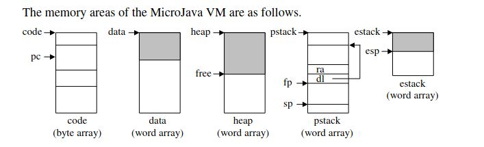

# NztCompiler - Compiler for MicroJava

Compiler for MicroJava (Java-like language) - Project for Compiler Construction 1 Course (School of Electrical Engineering 2021)


## The MicroJava Language 

This section describes the MicroJava language that is used in the practical part of the 
compiler construction module. MicroJava is similar to Java but much simpler.

### General Characteristics

* A MicroJava program consists of a single program file with static fields and static 
methods. There are no external classes but only inner classes that can be used as data types. 
* The main method of a MicroJava program is always called main(). When a Micro-Java program is called this method is executed.
* There are 
    * Constants of type int (e.g. 3) and char (e.g. 'x') but no string constants. 
    * Variables: all variables of the program are static. 
    * Primitive types: int, char (Ascii) 
    * Reference types: one-dimensional arrays like in Java as well as classes with fields but without methods. 
    * Static methods in the main class. 
* There is no garbage collector (allocated objects are only deallocated when the program ends). 
* Predeclared procedures are ord, chr, len.

More informations in microjava_spec.pdf.

### Sample program

```java
program Program

    class A{ int x[], y[]; } 
    const int pi = 3, e = 2; 
    class B extends A { 
        int i; 
        { 
            int getValue(int a) int b; bool c;
            { 
                return this.i + this.x[0] + a; 
            } 
            void m() {} 
        } 
    } 
    class C extends B {
        A theA;
        int a;
    }

{
    void main() A a; C c; int i; int x[]; char ch; { 
        a = new A; 
        a.x = new int[5]; 
        a.y = new int[5]; 

        c = new C; 
        c.theA = a; 
        c.x = new int[5]; 

        x = new int[3]; 

        read(c.i); 
        i = 0; 
        do { 
            read(c.x[i]); 
            read(c.theA.x[i]);  
            i++; 
        } while(i < 5);

        print(c.getValue(c.theA.x[0])); 

        c.m(); 
        read(ch);

        print(ch == ’e’ ? e : pi);

    } 
}
```

### Syntax

```
Program     = ʺprogramʺ ident {ConstDecl | VarDecl | ClassDecl} ʺ{ʺ {MethodDecl} ʺ}ʺ.
ConstDecl   = ʺconstʺ Type identʺ=ʺ(numConst | charConst | boolConst) {, ident ʺ=ʺ 
(numConst | charConst | boolConst)} ʺ;ʺ. 
VarDecl     = Type ident [ʺ[ʺ ʺ]ʺ] {ʺ,ʺ ident [ʺ[ʺ ʺ]ʺ]} ʺ;ʺ. 
ClassDecl   = ʺclassʺ ident [ʺextendsʺ Type] ʺ{ʺ  {VarDecl}  [ʺ{ʺ {MethodDecl} ʺ}ʺ]  ʺ}ʺ. 
MethodDecl  =   (Type | ʺvoidʺ) ident ʺ(ʺ [FormPars] ʺ)ʺ {VarDecl} ʺ{ʺ {Statement} ʺ}ʺ. 
FormPars    = Type ident [ʺ[ʺ ʺ]ʺ] {ʺ,ʺ Type ident [ʺ[ʺ ʺ]ʺ]}. 
Type        =  ident. 
Statement   =  DesignatorStatement  ʺ;ʺ  
            |  ʺifʺ ʺ(ʺ Condition ʺ)ʺ Statement [ʺelseʺ Statement]  
            | ʺdoʺ Statement ʺwhileʺ ʺ(ʺ Condition ʺ)ʺ ʺ;ʺ 
            | ʺswitchʺ ʺ(ʺ Expr ʺ)ʺ ʺ{ʺ {ʺcaseʺ numConst ʺ: ʺ {Statement} } ʺ}ʺ 
            |  ʺbreakʺ ʺ;ʺ 
            | ʺcontinueʺ ʺ;ʺ 
            | ʺreturnʺ [Expr] ʺ;ʺ  
            |  ʺreadʺ ʺ(ʺ Designator ʺ)ʺ ʺ;ʺ  
            |  ʺprintʺ ʺ(ʺ Expr [ʺ,ʺ numConst] ʺ)ʺ ʺ;ʺ  
            | ʺ{ʺ {Statement} ʺ}ʺ. 
DesignatorStatement = Designator (Assignop Expr | ʺ(ʺ [ActPars] ʺ)ʺ | ʺ++ʺ | ʺ‐‐ʺ) 
ActPars     =  Expr {ʺ,ʺ Expr}. 
Condition   =   CondTerm {ʺ||ʺ CondTerm}. 
CondTerm    =   CondFact  {ʺ&&ʺ CondFact}. 
CondFact    =  Expr [Relop Expr]. 
Expr        =  [ʺ-ʺ] Term {Addop Term} 
            |   Condition ʺ?ʺ Expr ʺ:ʺ Expr                    
            |   CondFact ʺ?ʺ Expr ʺ:ʺ Expr.                   
Term        =  Factor {Mulop Factor}. 
Factor      = Designator [ʺ(ʺ [ActPars] ʺ)ʺ]  
            |  numConst  
            |  charConst     
            |   boolConst   
            |  ʺnewʺ Type [ʺ[ʺ Expr ʺ]ʺ] 
            | ʺ(ʺ Expr ʺ)ʺ 
Designator  =  ident {ʺ.ʺ ident | ʺ[ʺ Expr ʺ]ʺ}. 
Assignop    = ʺ=ʺ. 
Relop       =  ʺ==ʺ | ʺ!=ʺ | ʺ>ʺ | ʺ>=ʺ | ʺ<ʺ | ʺ<=ʺ. 
Addop       =  ʺ+ʺ | ʺ‐ʺ. 
Mulop       =  ʺ*ʺ | ʺ/ʺ | ʺ%ʺ.
```

### MicroJava VM

The MicroJava VM is similar to the Java VM but has less and simpler instructions.  
Whereas the Java VM uses operand names from the constant  pool that are resolved by the loader, the MicroJava VM uses fixed operand addresses.
Java instructions encode the types of their operands so that a verifyer can check the consistency of an object file. MicroJava instructions do not encode operand types.

Memory layout:




## Run configs for Eclipse IDE

1. LexerGenerator
    * Main class: Jflex.Main
    * Program arguments: -d src/rs/ac/bg/etf/pp1 spec/mjlexer.flex
2. ParserGenerator
    * Main class: java_cup.Main
    * Program arguments: -destdir rs/ac/bg/etf/pp1 -dump_states -parser MJParser -ast rs.ac.bg.etf.pp1.ast -buildtree ../spec/mjparser.cup
3. Compile MJ Source
    * Main class: rs.ac.bg.etf.pp1.MJParserTest
    * Program arguments:test/test302.mj test/program.obj
4. Run
    * Main class: rs.etf.pp1.mj.runtime.Run
    * Program arguments: -debug test/program.obj
5. Disasm
    * Main class: rs.etf.pp1.mj.runtime.disasm
    * Program arguments: test/program.obj
6. MJCompiler – za testiranje rešenja
    * Main class: rs.ac.bg.etf.pp1.MJCompiler
    * Program arguments: test/test302.mj test/program.obj

## Provided tests

1. test301.mj – test provided by university professors that checks all functionalities for A level
2. test302.mj – test provided by university professors that checks all functionalities for B level
3. lexer_error.mj - test that contains lexical errors and checks if compiler will detect them
4. syntax_error.mj - test that contains syntax errors and checks if compiler will detect them and recover from them
5. semantic_error.mj - test that contains semantic errors and checks if compiler will detect them
